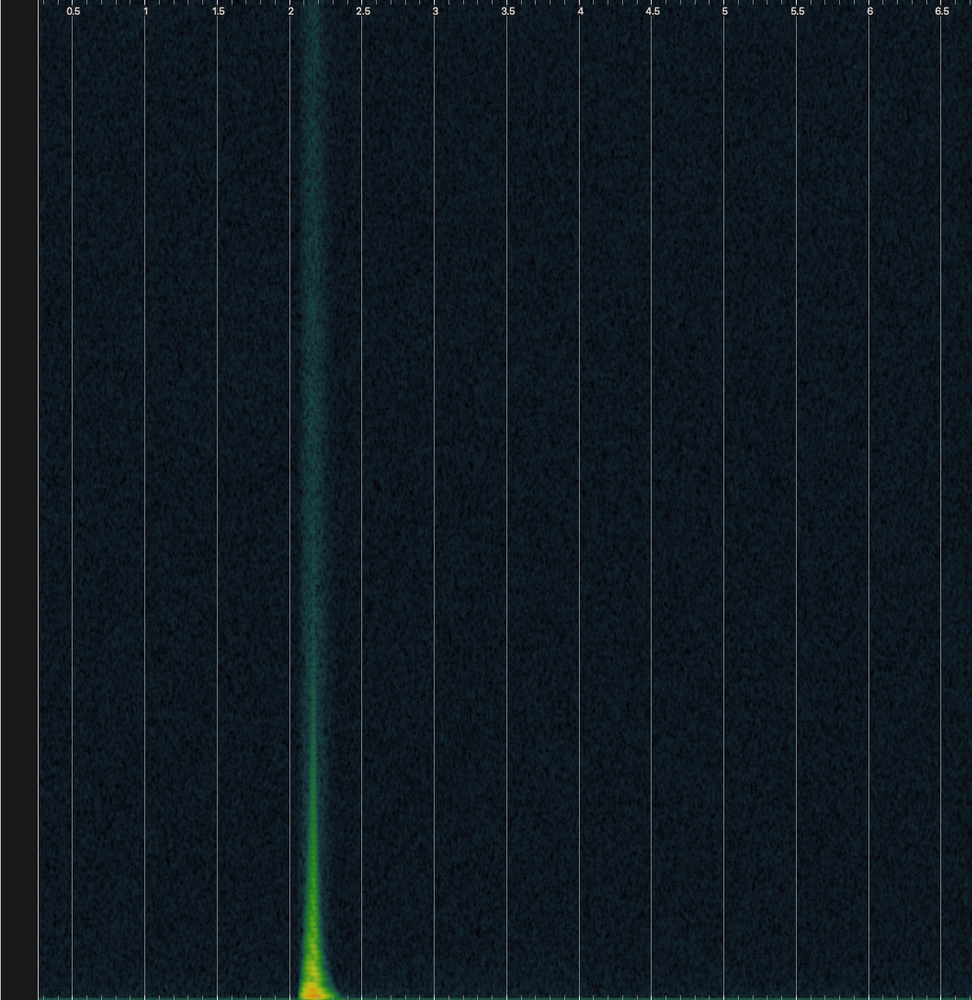

<!---layout: page
title: "Demos"
permalink: /demos/--->

<h2> Filter Pings </h2>

Audio has been normalized to enhance detail, and expose self resonances. I've kept the same settings across the different algorithms even when tweaking would be beneficial, to provide the fairest comparisons.

<a href="https://github.com/kaseypocius/MUMT618-DREV/blob/master/docs/audio/m32-dry_1.wav?raw=true">Dry </a> <br>
 <br>

<a href="https://github.com/kaseypocius/MUMT618-DREV/blob/master/docs/audio/m32-dry_2.wav?raw=true">Dry </a> <br>
 <br>

<a href="https://github.com/kaseypocius/MUMT618-DREV/blob/master/docs/audio/m32-dry_3.wav?raw=true">Dry </a> <br>
 <br>


Passed through the reverbs with the following Settings: <br>
```
StkFloat InputGain = 0.9;

StkFloat DistortionMix = 1;
StkFloat VerbMix = 0.1;

StkFloat InputDiffusionConstant1 = 0.75;
StkFloat InputDiffusionConstant2 = 0.625;
StkFloat DecayDiffusionConstant1 = 0.7;
StkFloat DecayDiffusionConstant2 = 0.5;
StkFloat Decay = 1.1;
StkFloat BandWidth = 1;
StkFloat Damping = 0.005 ;
StkFloat ExcursionMS = 0.5376163435;
```
<br>

<a href="https://github.com/kaseypocius/MUMT618-DREV/blob/master/docs/audio/verb-1-1.wav?raw=true">Blip </a> <br>
 <br>
<a href="https://github.com/kaseypocius/MUMT618-DREV/blob/master/docs/audio/verb-1-2.wav?raw=true">Sequence </a> <br>
 <br>
<a href="https://github.com/kaseypocius/MUMT618-DREV/blob/master/docs/audio/verb-1-3.wav?raw=true">Drone</a> <br>
 <br>

<h2> Setting 2 </h2>

Passed through the reverbs with the following Settings:<br>
```
StkFloat InputGain = 0.5;

StkFloat DistortionMix = 0.2;
StkFloat VerbMix = 0.1;

StkFloat InputDiffusionConstant1 = 0.75;
StkFloat InputDiffusionConstant2 = 0.625;
StkFloat DecayDiffusionConstant1 = 0.7;
StkFloat DecayDiffusionConstant2 = 0.5;
StkFloat Decay = 0.9999;
StkFloat BandWidth = 1;
StkFloat Damping = 0.005 ;
StkFloat ExcursionMS = 0.5376163435;
```
<a href="https://github.com/kaseypocius/MUMT618-DREV/blob/master/docs/audio/verb-2-1.wav?raw=true">Blip </a> <br>
 <br>
<a href="https://github.com/kaseypocius/MUMT618-DREV/blob/master/docs/audio/verb-2-2.wav?raw=true">Sequence </a> <br>
 <br>
<a href="https://github.com/kaseypocius/MUMT618-DREV/blob/master/docs/audio/verb-2-3.wav?raw=true">Drone </a> <br>
 <br>

<h2> Setting 3 </h2>

Passed through the reverbs with the following Settings: <br>
```
StkFloat InputGain = 0.25;

StkFloat DistortionMix = 0.;
StkFloat VerbMix = 0.1;

StkFloat InputDiffusionConstant1 = 0.75;
StkFloat InputDiffusionConstant2 = 0.625;
StkFloat DecayDiffusionConstant1 = 0.7;
StkFloat DecayDiffusionConstant2 = 0.5;
StkFloat Decay = 0.49999;
StkFloat BandWidth = 0.5;
StkFloat Damping = 0.005 ;
StkFloat ExcursionMS = 0.5376163435;
```
<a href="https://github.com/kaseypocius/MUMT618-DREV/blob/master/docs/audio/verb-3-1.wav?raw=true">Blip </a> <br>
 <br>
<a href="https://github.com/kaseypocius/MUMT618-DREV/blob/master/docs/audio/verb-3-2.wav?raw=true">Sequence </a> <br>
 <br>
<a href="https://github.com/kaseypocius/MUMT618-DREV/blob/master/docs/audio/verb-3-3.wav?raw=true">Drone </a> <br>
 <br>

<h2> Setting 4 </h2>

Passed through the reverbs with the following Settings:: <br>
```
StkFloat InputGain = 0.25;

StkFloat DistortionMix = 0.;
StkFloat VerbMix = 0.1;

StkFloat InputDiffusionConstant1 = 0.75;
StkFloat InputDiffusionConstant2 = 0.625;
StkFloat DecayDiffusionConstant1 = 0.7;
StkFloat DecayDiffusionConstant2 = 0.5;
StkFloat Decay = 0.99999;
StkFloat BandWidth = 0.95;
StkFloat Damping = 0.9005 ;
StkFloat ExcursionMS = 0.5376163435;

```

<a href="https://github.com/kaseypocius/MUMT618-DREV/blob/master/docs/audio/verb-4-1.wav?raw=true">Blip </a> <br>
 <br>
<a href="https://github.com/kaseypocius/MUMT618-DREV/blob/master/docs/audio/verb-4-2.wav?raw=true">Sequence </a> <br>
 <br>
<a href="https://github.com/kaseypocius/MUMT618-DREV/blob/master/docs/audio/verb-4-3.wav?raw=true">Drone </a> <br>
 <br>

<h2> Setting 5 </h2>

Passed through the reverbs with the following Settings:: <br>

```
StkFloat InputGain = 0.25;

StkFloat DistortionMix = 0.9;
StkFloat VerbMix = 0.1;

StkFloat InputDiffusionConstant1 = 0.75;
StkFloat InputDiffusionConstant2 = 0.625;
StkFloat DecayDiffusionConstant1 = 0.7;
StkFloat DecayDiffusionConstant2 = 0.5;
StkFloat Decay = 1;
StkFloat BandWidth = 0.15;
StkFloat Damping = 0.9005 ;
StkFloat ExcursionMS = 0.5376163435;
```
<a href="https://github.com/kaseypocius/MUMT618-DREV/blob/master/docs/audio/verb-5-1.wav?raw=true">Blip </a> <br>
 <br>
<a href="https://github.com/kaseypocius/MUMT618-DREV/blob/master/docs/audio/verb-5-2.wav?raw=true">Sequence </a> <br>
 <br>
<a href="https://github.com/kaseypocius/MUMT618-DREV/blob/master/docs/audio/verb-5-3.wav?raw=true">Drone </a> <br>
 <br>

<a href="https://kaseypocius.github.io/MUMT618-DREV/about"> Back to the About</a>
