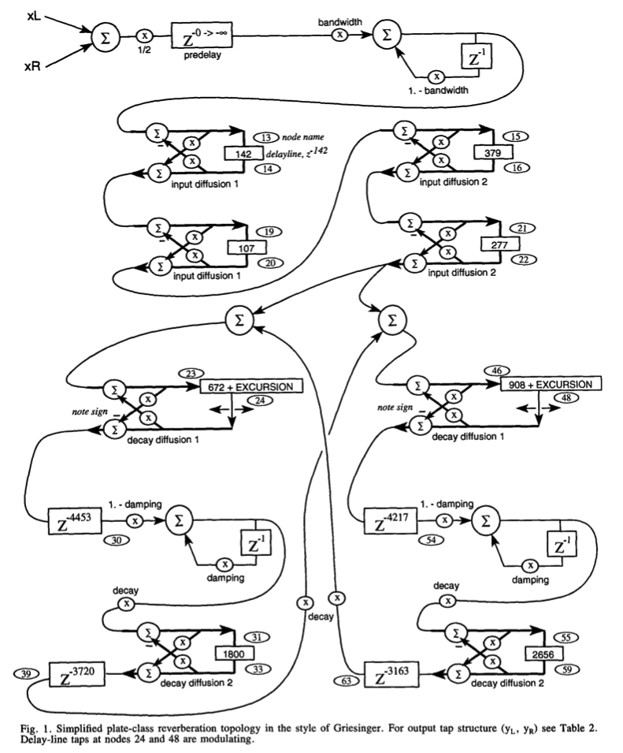

<!---layout: page
title: "Why?"
permalink: /why/--->

<h1> What is a plate reverb? </h1>
A plate reverb is the simulation of reverberation through the use of a physical plate, often made of gold. The source sound is played through the plate, where it is picked up by multiple piezo pickups placed throughout the plate. The plate can be damped by a secondary material, which is moved closer to the reverberator plate to reduce the reverb time and reduce the high frequency content.  
In digital algorithms, plate-style reverberation will often refer to any algorithm where there are little to no early reflections and the late reflections occur almost immediately.

<h2> Why the Dattorro Algortihms? </h2>
The algortihms proposed are simple and effecient, and I had previous positive experience with other reverbs based upon modifications to these algorithms. As a result I believed this algorithm to be a good fit to try and implement in STK, and could prove to be useful in the future should I seek to experiment more with expanding it. It also shares similarities in topology to more room focused reverbs such as John Chowning's JCRev and other Schroeder style reverberators already implemented in STK, while the plate style still being distinct enough that I felt it was worth pursuing. I've also worked to extend the excursion range, so more experimental modulation may be pursued if desired.

<h4> JCRev Signal Path</h4>
  

<h4> DRev Signal Path</h4>
  

<h4> Some other artistic inspirations worth mentioning</h4>
My personal experience of the following VSTs and hardware modules have heavily inspired the design here

<h6>Software</h6>
<a href="https://valleyaudio.github.io/rack/plateau/index.html"> Plateau </a> A VCV implementation and expantion on the Dattorro algorithm  
<a href="https://www.izotope.com/en/shop/exponential-audio-r4.html"> Exponential Audio R4, and their other reverbs </a> Software reverbs designed by another ex-lexicon employee (Michael Carnes), here with close to 20 years of expenations the algorithms, with additions such as multiband distortion, compression of the tail, bit crushing and more.  

<h6>Hardware</h6>
<a href="http://www.makenoisemusic.com/modules/erbe-verb">Make Noise Erbe Verbe </a> Tom Erbe's DSP Reverb for Make Noise, which implements saturation in a matrix style reverb to allow for feedback above 1, which is where I took the idea to implement saturation in the reverb loop. 
<a href="https://www.soundonsound.com/reviews/ursa-major-space-station"> Ursa Major Space Station </a> Another vintage digital reverb, with saturation on it's feedback path. 
<a href="https://www.sweetwater.com/insync/emt-140/">EMT-140</a> The Original gold plate reverb  

 <a href="https://kaseypocius.github.io/MUMT618-DREV/about"> Back to the About</a>
